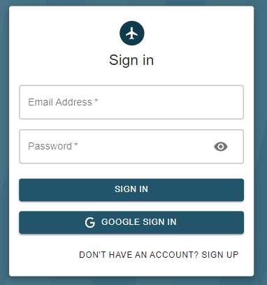

# Travel freak

<<<<<<< HEAD

 

---

## Sample UI

### Signup
=======
# Memories 
>>>>>>> 314cee85ff8702b9c1e2261658cee8083d073f38

### Signin

### Create Post

### Post

### Table of Contents

Sections headers will be used to reference location of destination.

<<<<<<< HEAD
- [Description](#description)
- [How To Use](#how-to-use)
- [Author Info](#author-info)
=======
This project was bootstrapped with [Create React App](https://github.com/facebook/create-react-app).
In the project directory, you can run:
>>>>>>> 314cee85ff8702b9c1e2261658cee8083d073f38

---

## Project Details

In this project different languages and frameworks are used for designing the frontend and building backend nicely. **React** is used in frontend to make website **UI** more beautiful. React makes it painless to create interactive UIs. Design simple views for each state in application, and React will efficiently update and render just the right components when data changes. Besides this in frontend **redux** is also included. **Redux** maintains the state of an entire application in a single immutable state tree (object), which can’t be changed directly. When something changes, a new object is created (using actions and reducers). In this project we will use **Nodejs** for back-end **API** services. **Express** is used as backend application. **Express** is a minimal and flexible Node.js web application framework that provides a robust set of features for website. For database management we will use mongo dB. **MongoDB** is a document-oriented database which stores data in JSON-like documents with dynamic schema. It means you can store your records without worrying about the data structure such as the number of fields or types of fields to store values.

---

#### Libraries or frameworks

- **Html & CSS**

- **JavaScript**

- **React**

- **Redux**

- **Nodejs**

- **Express**

- **Mongo dB**

[Back To The Top](#read-me-template)

---

## How To Use

#### Installation

For running on localhost you need to install VScode.
 
:arrow_right: Open a new terminal in vscode & split it into two window
 
:arrow_right: Go to client folder by command cd client
 
:arrow_right: In other window go to server folder by command cd server
 
:arrow_right: Run npm install in both terminal
 
:arrow_right: Run npm start in both terminal
 
 
:fire::fire: Boom You are ready to explore :fire::fire:

[Back To The Top](#read-me-template)

---
